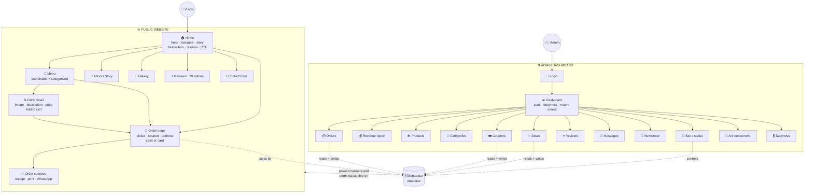
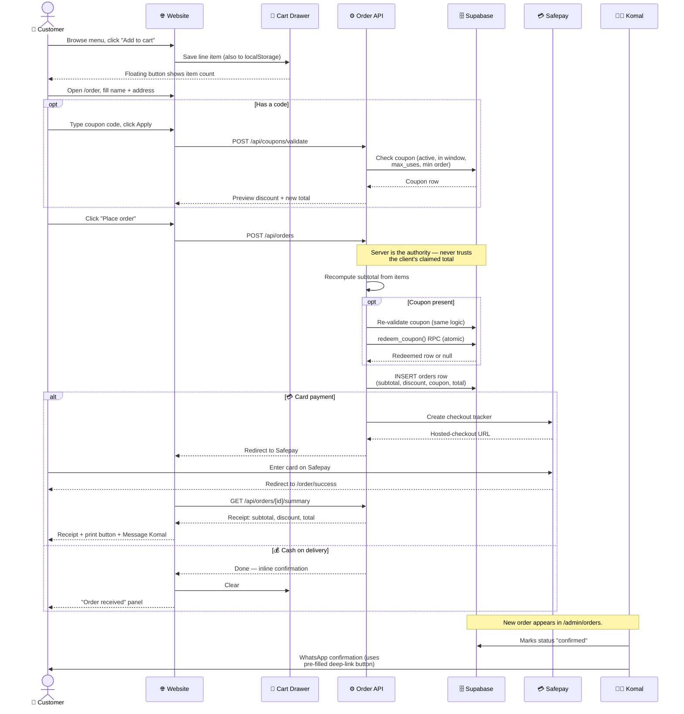
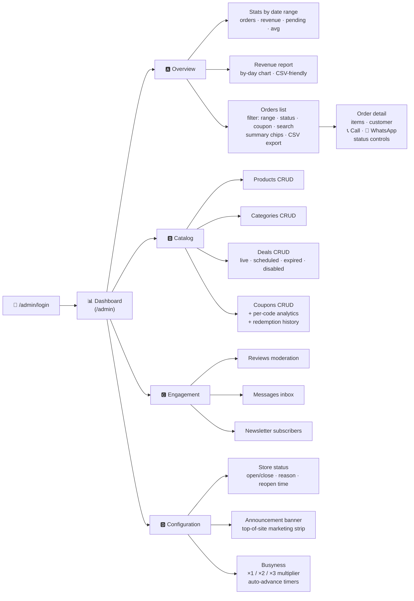
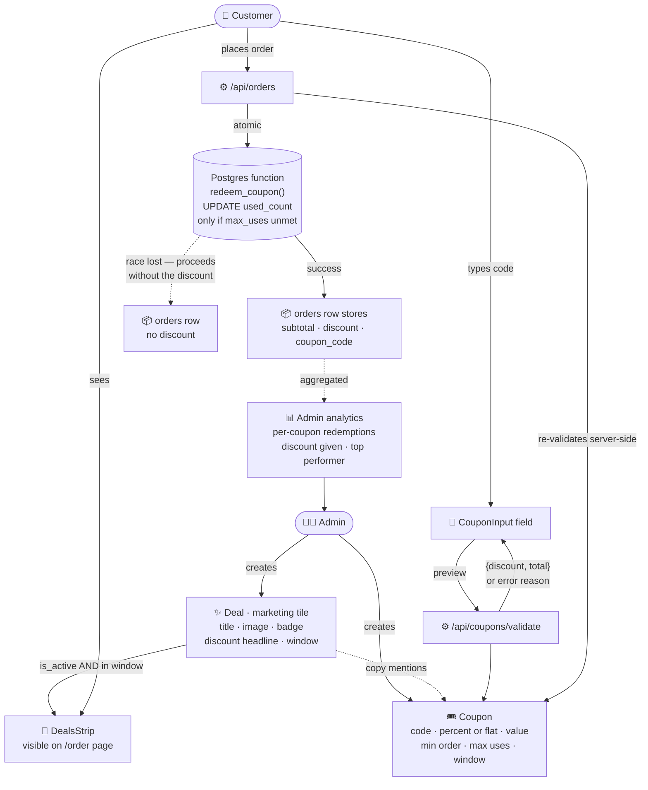
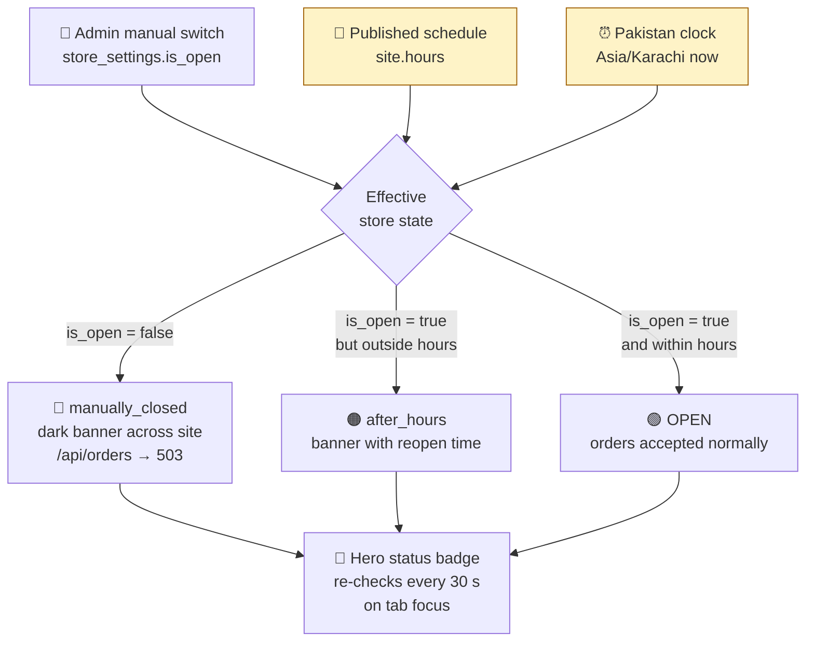
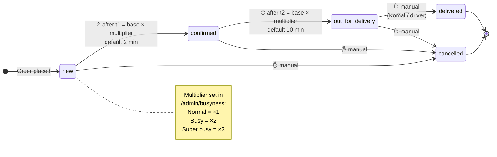
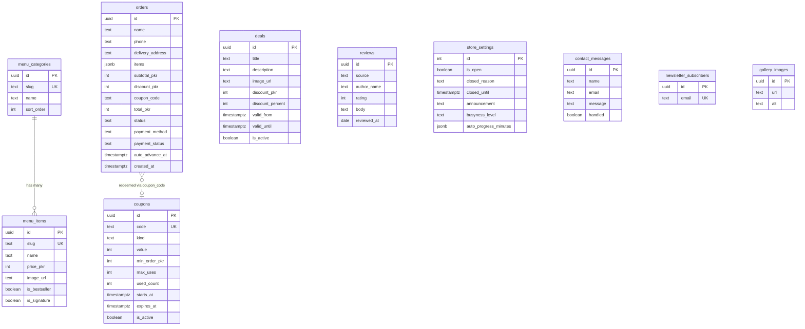
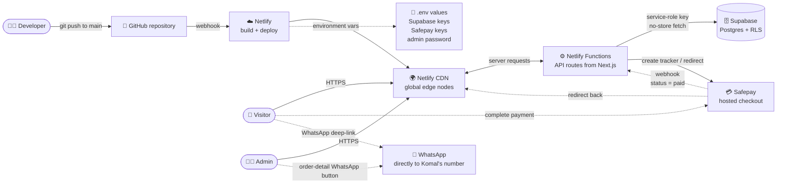

# Komal's Coffee — Site Flow Diagrams

A complete pictorial walkthrough of the website for explaining to the client. Every block below is a self-contained **Mermaid** diagram. Open https://mermaid.live, paste **one block at a time** (the lines between the ```` ```mermaid ```` fences only — not the fences themselves), and the rendered diagram appears on the right.

Use the heading above each block as the title when you talk through it.

---

## Table of contents

1. [The big picture — public site + admin](#1-the-big-picture--public-site--admin)
2. [Customer order journey — step by step](#2-customer-order-journey--step-by-step)
3. [What the admin can do](#3-what-the-admin-can-do)
4. [Deals + coupons lifecycle](#4-deals--coupons-lifecycle)
5. [How "Open / Closed" is decided](#5-how-open--closed-is-decided)
6. [Busyness — automatic order progression](#6-busyness--automatic-order-progression)
7. [Database tables and relationships](#7-database-tables-and-relationships)
8. [Hosting + deployment pipeline](#8-hosting--deployment-pipeline)

---

## 1. The big picture — public site + admin

Everything a visitor or the admin can reach, on one map. The public site is on the left; the admin dashboard is on the right.



---

## 2. Customer order journey — step by step

Exactly what happens from the moment a visitor adds something to the cart to the moment Komal is notified.



---

## 3. What the admin can do

Every screen the admin can reach, grouped by purpose. Each leaf is one page in the dashboard.



---

## 4. Deals + coupons lifecycle

How a marketing campaign goes from an idea in the admin head to a discount on a customer's order.



---

## 5. How "Open / Closed" is decided

Three signals combine to decide whether the store accepts orders right now.



---

## 6. Busyness — automatic order progression

Komal sets a busyness level (Normal / Busy / Super busy) which multiplies the auto-advance timers. New orders crawl forward through the pipeline by themselves; final delivery is always manual.



---

## 7. Database tables and relationships

The Supabase schema. Each box is a table; arrows mark foreign keys / soft links.



---

## 8. Hosting + deployment pipeline

What happens between a `git push` and the live site updating.



---

## How to present these to the client

1. **Open** https://mermaid.live in your browser.
2. **Open** this file (`SITE-FLOW.md`) in any text viewer.
3. For each section in turn:
   - Copy the lines between the ```` ```mermaid ```` and ```` ``` ```` fences.
   - Paste into the Mermaid Live editor's left panel.
   - The diagram renders instantly on the right.
   - Walk the client through it using the short paragraph above the block as your script.
4. Mermaid Live has an **Export → PNG / SVG** button if you want to save each diagram as an image for a slide deck.

> 💡 Tip — diagrams 1, 3, and 7 are the most impressive for a non-technical client. Lead with those, then drill into the journey (diagram 2) and the coupon flow (diagram 4) only if they want to go deeper.
